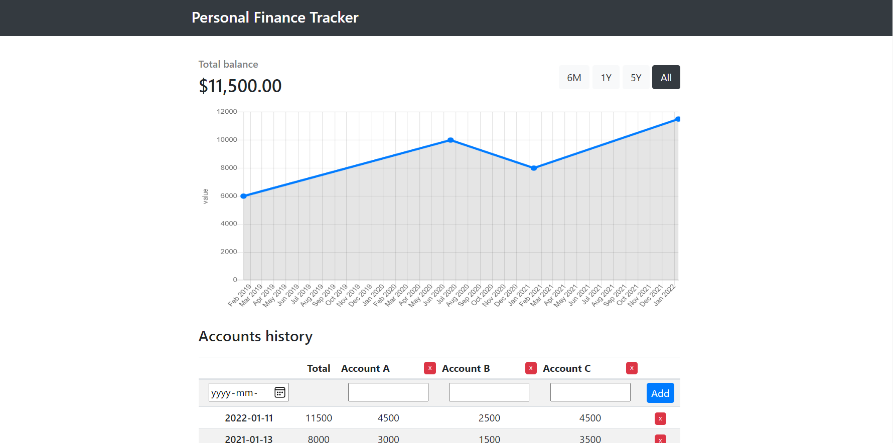

# Personal Finance Tracker app

This project is a simple financial account tracker with manual entry. It is a proof-of-concept demonstrating the usage of SQLite on Azure Functions.

I wrote an accompanying blog post noting the benchmarks of such a solution here: [Building a micro web application using Azure Functions and SQLite](https://blog.thomasgauvin.com/micro-web-application-azure-functions-sqlite)

## Deployment

*Deployment is slightly complicated by the fact that the NPM library SQLite3 must download the correct bindings to access the file system. This means that the `npm install` step during build
must happen on the remote Azure Functions server such that the correct bindings for the server's software versions are downloaded.*

0. Clone the source code of the application locally. Run `func start` and ensure the application is working locally.
1. Create an Azure Function resource in the Azure Portal, configured as a Consumption app with Windows as the OS. Take note of the name of the Function App you just created. This step will create the accompanying storage account which will store the SQLite database.
2. Deploy the application using the `func azure functionapp publish <FUNCTION_APP_NAME> --nozip`. This deploys the local source code to the Azure Function resource, and the `--nozip` options [turns off Run-From-Package mode](https://docs.microsoft.com/en-us/azure/azure-functions/functions-core-tools-reference?tabs=v2#func-azure-functionapp-publish). This will allow us to manually install npm packages in the Azure portal. 
3. From the Azure Portal, navigate to the Azure Function. In the left menu pane of the Azure Function, navigate to Console.
